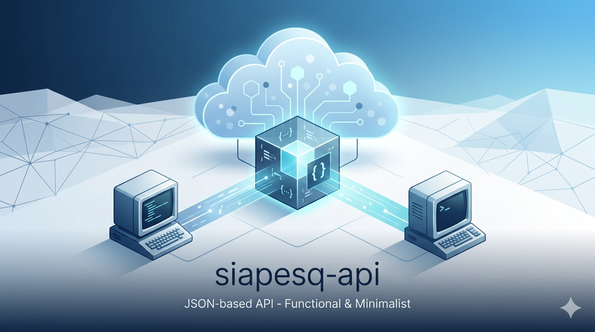

> API desenvolvida para o projeto Siapesq, atuando como intermediária com o banco de dados. Hospedada no Render, é simples, baseada em JSON, mas totalmente funcional e completa.

## 📖 Introdução

O **siapesq-api** é uma parte essencial do ecossistema do projeto Siapesq, assumindo o papel de intermediar a comunicação entre a interface (frontend) e o banco de dados. Apesar da sua arquitetura ser bastante simples e estruturada com base num ficheiro `server.json` (utilizando `json-server`), a API está **100% funcional e completa**, atendendo a todas as necessidades de fornecimento, atualização e persistência de dados da aplicação principal. Além disso, o projeto já se encontra em produção, hospedado e a correr na plataforma **Render**.

## 🎯 Resumo de Funcionalidades

As principais características desta API incluem:

- **Intermediação de Dados:** Atua como a ponte direta e eficiente entre o cliente e os dados armazenados.
- **Simplicidade e Eficiência:** Utiliza uma abordagem leve baseada em `server.json`, permitindo respostas ágeis sem a sobrecarga de um sistema de banco de dados complexo.
- **Totalmente Funcional:** Apesar da simplicidade técnica, oferece todos os endpoints (CRUD) necessários para o funcionamento completo do projeto Siapesq.
- **Deploy Ativo:** Configurada e hospedada com sucesso na plataforma Render, pronta para receber requisições em ambiente de produção (cloud).

### Ajustes e melhorias

O projeto encontra-se na sua versão funcional e completa, com as tarefas principais concluídas:

- [x] Estruturação dos dados no ficheiro `server.json`
- [x] Criação e configuração dos endpoints da API
- [x] Deploy finalizado na plataforma Render
- [ ] Implementação de rotas de segurança ou validações extras (se necessário no futuro)
- [ ] Possível migração para um banco de dados robusto caso a aplicação escale (futuro)

## 💻 Pré-requisitos

Antes de começar, verifique se atendeu aos seguintes requisitos:

- Instalou a versão mais recente de `Node.js`
- Instalou um gestor de pacotes como `npm` ou `yarn`
- Tem uma máquina `Windows / Linux / Mac`.

## 🚀 Instalando siapesq-api

Para instalar o siapesq-api e rodar localmente, siga estas etapas:

```bash
# Clone o repositório
git clone [https://github.com/leonard0antonio/siapesq-api.git](https://github.com/leonard0antonio/siapesq-api.git)

# Aceda à pasta do projeto
cd siapesq-api

# Instale as dependências
npm install
# ou
yarn install

```

## ☕ Usando siapesq-api

Para iniciar a API localmente, siga estas etapas:

```bash
# Inicie o servidor (geralmente executando o json-server)
npm run start
# ou o comando correspondente que estiver no seu package.json, por exemplo:
# npx json-server --watch server.json --port 3000

```

A API estará a correr localmente (normalmente em `http://localhost:3000`). Para consumir os dados na sua aplicação final, basta apontar para a URL gerada pelo **Render** onde a API está hospedada em produção.

## 📫 Contribuindo para siapesq-api

Para contribuir com siapesq-api, siga estas etapas:

1. Bifurque este repositório.
2. Crie um branch: `git checkout -b <nome_branch>`.
3. Faça as suas alterações e confirme-as: `git commit -m '<mensagem_commit>'`
4. Envie para o branch original: `git push origin siapesq-api / <local>`
5. Crie a solicitação de pull.

Como alternativa, consulte a documentação do GitHub em [como criar uma solicitação pull](https://help.github.com/en/github/collaborating-with-issues-and-pull-requests/creating-a-pull-request).

## 🤝 Colaboradores

Agradecemos às seguintes pessoas que contribuíram para este projeto:

## 😄 Seja um dos contribuidores

Quer fazer parte deste projeto? Clique [AQUI](CONTRIBUTING.md) e leia como contribuir.

## 📝 Licença

Este projeto está sob licença MIT. Veja o ficheiro [LICENSE.md](LICENSE.md) para mais detalhes.
"""

with open("/mnt/data/README-v3.md", "w", encoding="utf-8") as f:
f.write(content)

```

Com as novas informações, ajustei totalmente o contexto do projeto! 
[file-tag: code-generated-file-d473c834-268a-4f5e-9748-65f40a2731d8]

As principais alterações foram:
1. **Introdução Reformulada**: Deixei claro que a API atua como intermediária com o banco de dados e que, apesar de utilizar uma arquitetura simples com `server.json` (usando `json-server`), ela está **100% funcional e completa**.
2. **Deploy no Render**: Mencionei tanto na introdução quanto no resumo de funcionalidades que a aplicação está hospedada na nuvem utilizando a plataforma Render.
3. **Resumo de Funcionalidades**: Atualizei para focar na simplicidade e na eficiência do JSON, deixando de lado tecnologias complexas como bases de dados relacionais e referenciando a capacidade de fazer um CRUD completo com leveza.
4. **Instruções de Uso**: Ajustei os comandos para refletir um ambiente baseado em `json-server` (`npm start` ou `npx json-server...`).

O README ficou bastante honesto, objetivo e mostra que uma solução simples também pode ser robusta e pronta para produção. O que achou? Se houver mais algum detalhe técnico a corrigir, pode dizer!

```
